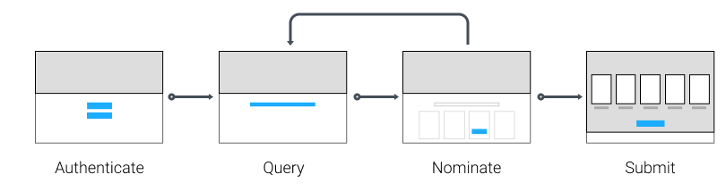

## Shoppies Nominator App
It's time to nominate your favourite films for this year's awards!  This app was made for the Winter 2021 UX Developer Intern & Web Developer Intern Challenge. Made using ReactJS and Firebase for authentication and database services.  
  
See the live hosted app at [https://shoppies-henryliang2.netlify.app](https://shoppies-henryliang2.netlify.app/)

## Demonstration  
  

  
## Design Notes   
**User Experience**  
  
This app was designed and built with user experience and usability principles in mind. I made sure to focus on simplicity, minimalism, and providing the user with each new task in a clear and stepwise fashion. The UI elements were made to be intuitive and easy for the user to discover organically. UI elements are also removed when appropriate in order to limit any confusion.  After the user nominates their final movie, the interface changes stylistically to imbue a strong sense of gravity in the user's actions.
    

    
**Data Model**  
  
The Shoppies Nominator uses a document database for storage of each user's nominated movies. See below for an example of a document:
  
```
{
  "uid": "lABAVxR1WUYCSQo4wwuRIXRNMwp2",
  "email": "henryliang@alumni.ubc.ca",
  "nominatedMovies": [
    {
      "Poster": "https://m.media-amazon.com/images/M/MV5BMTc2MTQ3MDA1Nl5BMl5BanBnXkFtZTgwODA3OTI4NjE@._V1_SX300.jpg",
      "Title": "The Martian",
      "Type": "movie",
      "Year": "2015",
      "imdbID": "tt3659388"
    },
    {
      "Poster": "https://m.media-amazon.com/images/M/MV5BMjAxMzY3NjcxNF5BMl5BanBnXkFtZTcwNTI5OTM0Mw@@._V1_SX300.jpg",
      "Title": "Inception",
      "Type": "movie",
      "Year": "2010",
      "imdbID": "tt1375666"
    }
  ]
}
```
  
## Challenge Details
**Challenge Outline**  
  
Shopify needs a webpage that can search ​OMDB​ for movies, and allow the user to save their favourite films they feel should be up for nomination. When they've selected 5 nominees they should be notified they're finished.
  
Shopify requires a simple to use interface that makes it easy to:  
* Search OMDB and display the results (movies only)  
* Add a movie from the search results to our nomination list 
* View the list of films already nominated
* Remove a nominee from the nomination list
  
**Technical Requirements**
1. Search results should come from OMDB's API.
2. Each search result should list at least its title, year of release and a button to nominate that film.
3. Updates to the search terms should update the result list
4. Movies in search results can be added and removed from the nomination list.
5. If a search result has already been nominated, disable its nominate button.
6. Display a banner when the user has 5 nominations.

## External Resources Used
[OMDb API](http://www.omdbapi.com/), [Firebase API](https://firebase.google.com/), [Shopify Polaris](https://polaris.shopify.com/), [Material UI Icons](https://material-ui.com/), [react-confetti](https://www.npmjs.com/package/react-confetti)
